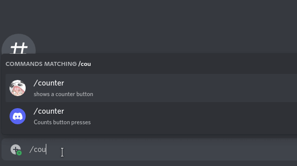

<center>
  
</center>

## Installation ∙ [](https://www.npmjs.com/package/reacord)

```console
# npm
npm install reacord react discord.js

# yarn
yarn add reacord react discord.js

# pnpm
pnpm add reacord react discord.js

```

## Get Started

[Visit the docs to get started.](https://reacord.mapleleaf.dev/guides/getting-started)

## Example

<!-- prettier-ignore -->
```tsx
import { useState } from "react"
import { Embed, EmbedField, Button } from "reacord"

interface EmbedCounterProps {
  count: number
  visible: boolean
}

function EmbedCounter({ count, visible }: EmbedCounterProps) {
  if (!visible) return <></>

  return (
    <Embed title="the counter">
      <EmbedField name="is it even?">{count % 2 ? "no" : "yes"}</EmbedField>
    </Embed>
  )
}

function Counter() {
  const [showEmbed, setShowEmbed] = useState<boolean>(false)
  const [count, setCount] = useState<number>(0)
  const instance = useInstance()

  return (
    <>
      this button was clicked {count} times
      <EmbedCounter count={count} visible={showEmbed} />
      <Button
        style="primary"
        label="clicc"
        onClick={() => setCount(count + 1)}
      />
      <Button
        style="secondary"
        label={showEmbed ? "hide embed" : "show embed"}
        onClick={() => setShowEmbed(!showEmbed)}
      />
      <Button
        style="danger"
        label="deactivate"
        onClick={() => instance.destroy()}
      />
    </>
  )
}
```


